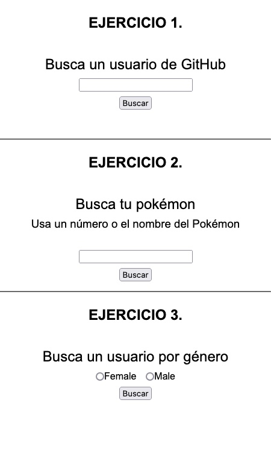
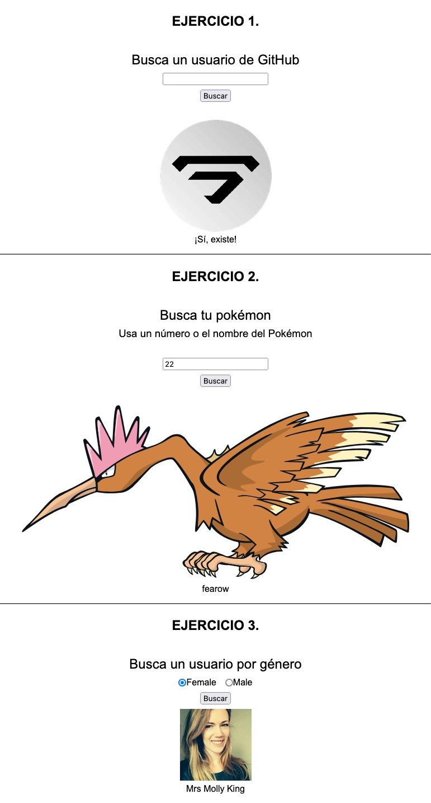

# 0003

## Resultado.

- **Ejercicio 1:** Realiza una pequeña aplicación que permita escribir el nombre de un usuario de Github en un input y muestre la foto de perfil en caso de encontrarlo.

- **Ejercicio 2:** Realiza una pequeña aplicación que permita escribir el nombre de un pokemon y muestre imagen que encontrarás en el JSON que retorna la PokeAPI usando el siguiente endpoint: https://pokeapi.co/api/v2/pokemon/

- **Ejercicio 3:** Realiza una pequeña aplicación que permita seleccionar el género de un usuario aleatorio a obtener de la api Random User usando el siguiente endpoint: https://randomuser.me/api/?gender=

|   Estado inicial   |   Funcionando   |
|-------------|-------------|
|  |  |

